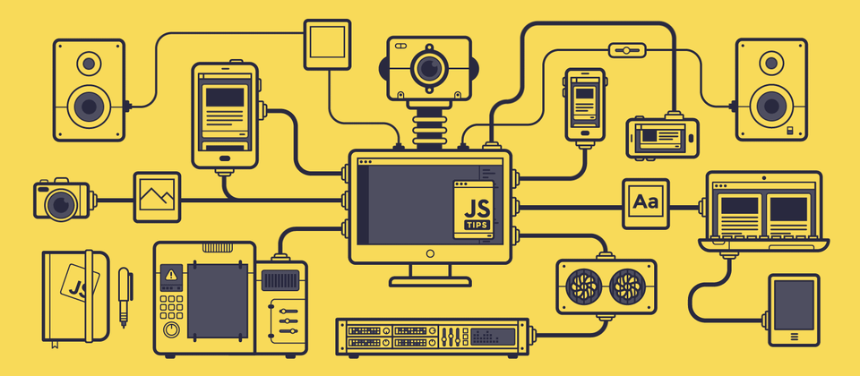

<table border="0">
 <tr>
    <td>
      <br>
     <p align="center">
       
      <br>
      
    <td>
      
   </td>  
 </tr>  
</table>

<h2 align="center">MY INFORMATION :
</b></h3>

```go
package main

import "fmt"

type Person struct {
  name     string
  username string
  age      int
  hobbies  []string
  job      string
}

func main() {
  var me = new(Person)

  me.name     = "Ahmed Raouf"
  me.username = "Ahmed-Raouf-Metwally"
  me.age      = 26
  me.job      = "Backend developer | Web developer"
  me.hobbies  = []string{"code", "anime", "music", "gaming"}

  fmt.Println(me)
}
```

<p align="center"></p>

##  Connect With Me

<p align="center">
<div align="center">
  <a href="https://mail.google.com/mail/?view=cm&fs=1&to=ahmedraouf.metwally@gmail.com" target="_blank">
    
  </a>
  <a href="https://wa.me/message/ZNFWQ66ROSEEF1?src=qr" target="_blank">
    
  </a>
  <a href="https://t.me/AhmedRaouf_Metwally" target="_blank">
    
  </a>
  <a href="https://signal.me/#eu/EGlCHEeZi_urUmykIJ_niA8eJIB476j6DtCTzq0JqBH2JTEmxWhOBpsUqTBzu9TN" target="_blank">
    
  </a>
  <a href="https://www.linkedin.com/in/ahmed-abdul-raouf/" target="_blank">
    
  </a>
  <a href="https://discord.gg/vsqGPeuZ" target="_blank">
    
  </a>
  <a href="https://www.facebook.com/AhmedRaouf.Metwally/" target="_blank">
    
  </a>
  <a href="https://www.instagram.com/ahmedraouf.metwally/" target="_blank">
    
  </a>
  <a href="https://x.com/ahmed_Raouf0" target="_blank">
    
  </a>
</div>
<br>
<div align="center">
<a href="https://dev-ahmed-raouf.vercel.app/" target="_blank">
</a> 
</div>

###

<p align="center"></p>

## Spent My Time

<p align="center">
    <a href="https://github.com/Ahmed-Raouf-Metwally">
          
    
  </a>
</p>
<br>

<p align="center"></p>

## 🤷‍♂️ Vistors Count

<div align="center">
  
</div>
<p align="center"></p>

## My Favorite Tools And Technologies ⚙️

> Tools and technologies that I have worked with and I'm interested in

<table>
  <tr>
    <td align="center" width="96">
        
      <br>C#
    </td>
    <td align="center" width="96">
      <a href="#macropower-tech">
        
      </a>
      <br>Python
    </td>
    <td align="center" width="96">
        
      <br>Javascript
    </td>
    </td>
       <td align="center" width="96">
        
      <br>Typescript
    <td align="center" width="96">
        
      <br>C++
    </td>
       <td align="center" width="96">
        
      <br>Github
    </td>
    <td align="center" width="96">
        
      <br>Rest API
        </td>
          <td align="center" width="96">
        
      <br>GrapQL
    </td>
          <td align="center" width="96">
        
      <br>React
    </td>
    <td align="center" width="96">
        
      <br>Nginx
    </td>
  </tr>
  <tr>
     </td>
    <td align="center" width="96">
        
      <br>Docker
    </td>
    <td align="center" width="96">
        
      <br>Git
    </td>
    <td align="center"  width="96">
        
      <br>GitLab
    </td>
    <td align="center"  width="96">
        
      <br>HTML
    </td>
    <td align="center" width="96">
        
      <br>CSS
    </td>
    <td align="center"  width="96">
        
      <br>Bootstrap
    </td>
    <td align="center" width="96">
        
      <br>Tailwind
    </td>
        <td align="center" width="96">
        
      <br>JQuery
    </td>
       <td align="center" width="96">
        
      <br>PostgreSQL
    </td>
     <td align="center" width="96">
        
      <br>ASP.NET
    </td>
  </tr>
   <tr>
         <td align="center" width="96">
        
      <br>Postman
    </td>
            <td align="center" width="96">
        
      <br>Linux
    </td>
  </tr>
  
</table>
 
<p align="center"></p>

### 🏆GitHub Trophies

<p align="center">
    <a href="https://github.com/Ahmed-Raouf-Metwally">
          
    
    <!--  -->
  </a>
</p>
<p align="center"></p>
<p align="center"></p>

##  Github Profile States

<p align="center">
<a href="https://github.com/Ahmed-Raouf-Metwally"> 
  </a>
</p>

- Note : **Top languages is only a metric of the languages my public code consists of and doesn't reflect experience or skill level.**
<p align="center"></p>

### 📊 GitHub States

<p align="center">
<a href="https://github.com/Ahmed-Raouf-Metwally">

 </a></p>
<p align="center">
<a href="https://github.com/Ahmed-Raouf-Metwally">


  </a>
</p>

<p align="center"></p>

### 🎶 Spotify Recently Played

<div align="center">
  <a href="https://open.spotify.com/user/31rgo6rhkc4545vgg76tmeq7kehq">
    
  </a>
</div>

<p align="center"></p>

### 📊 GitHub States

<!-- Contribution Snake -->
<p align="center"></p>

<p align="center"></p>

<!-- Footer -->


<div align="center">
</div>
